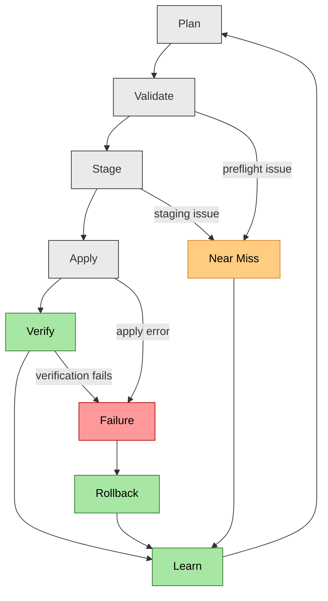

> **Attention**  
> 
> This repository is an *instructive tool* and is part of a series of guidebooks on safety tools. Use it for learning and demonstration purposes only; it is **not intended for unsupervised or production-critical use**.
> 

# rmrf - The Safer 'rm -rf' that No One Asked For

rmrf is a safer version of 'rm -rf', though it is not intended to be used as a direct replacement. Instead, it demonstrates how operators can design their own safe tools for managing complex systems. It is now easier than ever to build your own tools, giving operators the opportunity to take control of their own destiny, to design their own fate. They now have the ability to build better tools to help future versions of themselves.

rmrf is an exploration of the basics of building a safe operational tool and is intended as an example as opposed to a production-ready tool. We have used 'rm -rf' as a starting point because it is a highly visible and well-known command that is clearly dangerous in many situations, and, what one might consider the ultimate 'footgun'.

When operating complex systems, we don't want 'footguns'; we want safe, easy-to-use tools that follow safety best practices. rmrf is a starting point for operators to build their own tools and understand the basics of creating safe tools.

## How It Works

With rmrf we plan actions, and then execute them in a multi-stage workflow with safety checkpoints:

1. **Plan** - Scan targets, calculate risk score, generate unique plan ID
2. **Validate** - Check against protection level constraints and policies
3. **Approve** - For high-risk operations, require approval from a different user
4. **Stage** - Create verified backup copies with SHA-256 checksums
5. **Apply** - Execute the action with verification
6. **Verify** - Confirm the action was successful
7. **Learn** - Record lessons learned and close out the plan

High-risk deletions in production environments require multi-user approval. The approving user must be a different Linux user (different UID) than the plan creator, preventing a single person from executing dangerous operations without oversight.

## Getting Started

See the [Quick Start Guide](docs/quickstart.md) for installation and setup instructions.

## Caveats and Limitations

rmrf is not intended to implement every possible safety feature in every situation. Much like cybersecurity, safety is driven by economics;we simply can't implement everything. However, there are certain low-hanging fruits and relatively straightforward items that we can do to make our tools and systems safer, and rmrf does its best to implement these.