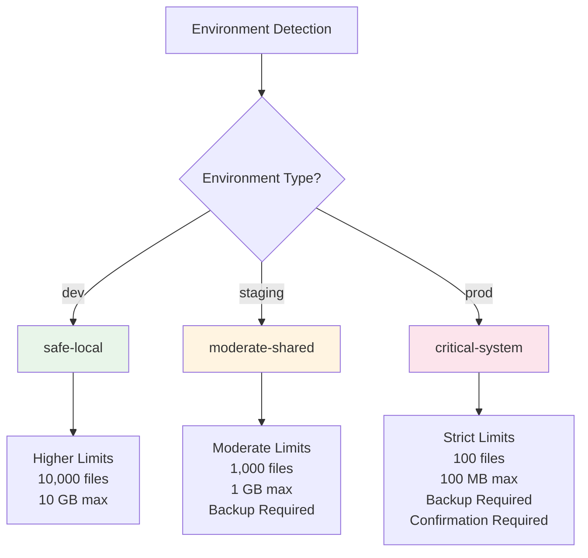

# Protection Levels

rmrf automatically applies environment-specific protection levels to enforce appropriate safety constraints.

## How Protection Levels Work



## Default Protection Levels

| Level              | Environment | Max Files | Max Size | Backup Required | Confirmation |
|--------------------|-------------|-----------|----------|-----------------|--------------|
| **safe-local**     | dev         | 10,000    | 10 GB    | No              | No           |
| **moderate-shared** | staging     | 1,000     | 1 GB     | Yes             | No           |
| **critical-system** | prod        | 100       | 100 MB   | Yes             | Yes          |

## What Protection Levels Control

Protection levels control:
- **File and size limits** - Maximum files/bytes that can be deleted
- **Backup requirements** - Whether backup is mandatory before deletion
- **Audit requirements** - Whether audit logging is mandatory
- **Confirmation requirements** - Whether user confirmation is needed
- **Retention periods** - How long backups are kept

Production environments automatically use stricter protection levels with lower limits and mandatory backups to prevent accidental data loss.

## Custom Protection Levels

You can define custom protection levels in `/etc/rmrf/protection_levels.d/*.yaml`:

```yaml
name: audit-strict
description: "High audit retention mode"
max_files: 1000
max_bytes: 1073741824  # 1 GB
require_backup: true
require_audit: true
require_confirmation: false
retention_days: 30
```

Custom protection levels are loaded at runtime and can be selected based on environment or explicit override.

See [Configuration Guide](configuration.md) for more details on environment detection and directory setup.
