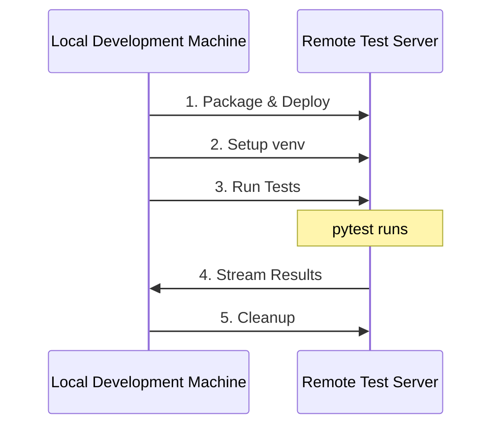

# rmrf Integration Tests

Integration tests for the complete rmrf workflow. As rmrf deletes files, it's best to run these tests on a remote server to properly test file operations in isolation.

## Quick Start

### 1. Setup Remote Test Server

```bash
# Setup and prepare remote server
make setup-remote TEST_HOST=rmrf-test

# Verify server is ready
make verify-remote TEST_HOST=rmrf-test
```

### 2. Run Tests

```bash
# Run all integration tests (also installs rmrf on remote server)
make test-integration-remote TEST_HOST=rmrf-test

# Run specific test
make test-integration-remote TEST_HOST=rmrf-test FILTER=test_workflow

# Run tests matching pattern
make test-integration-remote TEST_HOST=rmrf-test FILTER="test_plan or test_backup"
```

### 3. Use rmrf on Remote Server

After running tests, rmrf is installed and ready to use:

```bash
# Login to remote server
ssh rmrf-test

# Activate rmrf environment
cd ~/rmrf && source .venv/bin/activate

# Use rmrf
rmrf --help
rmrf plan /tmp/test-dir
```

Every test run updates rmrf to the latest code from your local working directory.

## Remote Testing Architecture

### Why Remote Testing?

Integration tests for rmrf **must** run on a remote server because:

1. **Isolation** - Tests create, modify, and delete files without affecting local development
2. **Clean Environment** - Each test run starts with a known-good state
3. **Real-World Conditions** - Tests run in environment similar to production
4. **Safety** - Protects your local files from test deletion operations
5. **Reproducibility** - Consistent test environment across team members

### How It Works



### Remote Test Lifecycle

1. **Package** - Local code packaged into tarball (excludes .venv, caches)
2. **Deploy** - Tarball copied to `~/rmrf` on remote (permanent installation)
3. **Setup** - Virtual environment created/updated, dependencies installed
4. **Execute** - pytest runs tests on remote server
5. **Report** - Results streamed back to local terminal
6. **Persist** - Installation remains at `~/rmrf` for manual use

**Key Difference**: Unlike typical test runs, the rmrf installation is **permanent** and updates with each test run, allowing you to SSH to the remote server and use the latest version of rmrf interactively.

## Remote Server Requirements

### Minimum Requirements

- **OS**: Linux (Ubuntu 20.04+, Debian 11+, or similar)
- **Python**: 3.10 or higher
- **Disk**: 1GB free space in `/tmp`
- **Memory**: 512MB available
- **Network**: Internet access (to install dependencies)

### Prerequisites

- SSH access already configured to remote test server
- Remote server has Python 3.10+ and basic tools

**Usage:**

```bash
# Use hostname from your SSH config
make setup-remote TEST_HOST=rmrf-test

# Or use full SSH specification
make setup-remote TEST_HOST=ubuntu@rmrf-test.example.com
```

## Scripts

### setup_remote.sh

Prepares remote server for testing:

- Verifies SSH connectivity
- Checks system requirements (Python, disk space)
- Installs `uv` package manager if needed
- Creates test directories with proper permissions
- Verifies setup completion

**Usage:**
```bash
./tests/integration/setup_remote.sh rmrf-test
```

### verify_remote.sh

Verifies remote server is ready:

- SSH connection
- Python 3.10+ installed
- `uv` package manager available
- Sufficient disk space
- Write permissions in `/tmp`
- Network connectivity
- Test directories exist

**Usage:**
```bash
./tests/integration/verify_remote.sh rmrf-test
```

### run_remote_tests.sh

Executes integration tests on remote:

- Packages local code (excluding development files)
- Deploys to remote `~/rmrf` (permanent installation)
- Creates/updates virtual environment
- Installs/updates rmrf with latest code
- Runs pytest with specified filter
- Streams results to local terminal
- Preserves installation for manual use

**Usage:**
```bash
./tests/integration/run_remote_tests.sh rmrf-test
./tests/integration/run_remote_tests.sh rmrf-test test_workflow
```

After tests complete, rmrf remains installed at `~/rmrf` on the remote server.

